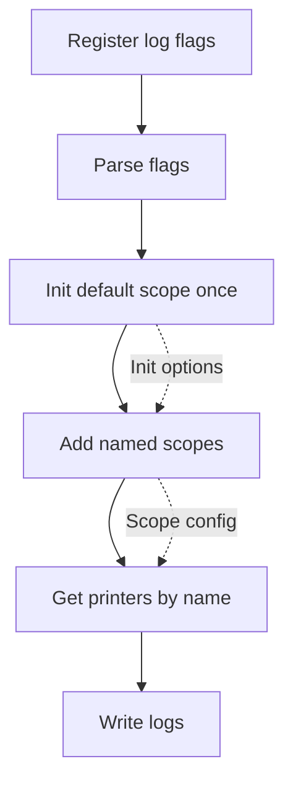
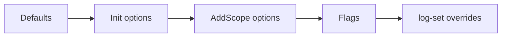

# logmgr

[简体中文](./README.zh-CN.md)

`github.com/nexuer/log/logmgr` is the process-wide logger manager for
`github.com/nexuer/log`. The application owner initializes it once, creates
configured scopes, and packages use `log.Printer` values to write logs.

## Install

```sh
go get github.com/nexuer/log
```

## Startup Flow



Typical setup:

```go
package main

import (
	"flag"

	"github.com/nexuer/log"
	"github.com/nexuer/log/logmgr"
)

func main() {
	logmgr.AddFlags(flag.CommandLine)
	flag.Parse()

	m := logmgr.Init("server",
		logmgr.WithFields(log.String("service", "api")),
	)

	db := m.MustAddScope("db", logmgr.WithLevel(log.LevelWarn))

	m.Printer().Info("server started")
	m.Printer("worker").Infof("job %d started", 42)
	db.Printer().Warn("database latency is high")
	db.Printer("mysql").Error("query failed")
}
```

Text output:

```text
[server] INFO service=api msg="server started"
[server.worker] INFO service=api msg="job 42 started"
[db] WARN service=api msg="database latency is high"
[db.mysql] ERROR service=api msg="query failed"
```

JSON output with JSON format enabled:

```json
{"logger":"server","level":"INFO","service":"api","msg":"server started"}
{"logger":"server.worker","level":"INFO","service":"api","msg":"job 42 started"}
{"logger":"db","level":"WARN","service":"api","msg":"database latency is high"}
{"logger":"db.mysql","level":"ERROR","service":"api","msg":"query failed"}
```

## Core API

`Init(name, opts...)` installs the singleton manager. It may only be called
once; calling it again panics. `name` is the default scope name and must not be
empty.

```go
m := logmgr.Init("server")
logmgr.M().Printer("worker").Info("started")
```

`M()` returns the singleton manager and panics if `Init` has not been called.
This keeps ownership clear: startup code initializes the manager, and other
packages either receive `log.Printer` values or call `logmgr.M()` after startup.

`AddScope(name, opts...)` creates a named configuration scope. It returns an
error if the scope already exists. `MustAddScope` panics on that error.

```go
db, err := logmgr.M().AddScope("db", logmgr.WithLevel(log.LevelWarn))
if err != nil {
	return err
}
_ = db
```

`Printer(name)` is get-or-create. Repeated calls with the same name return the
same printer, and creating a printer does not change scope configuration.

```go
worker := logmgr.M().Printer("worker") // name: server.worker
mysql := logmgr.M().Scope("db").Printer("mysql") // name: db.mysql
```

## Scopes

A scope is a named configuration area. Printers in the same scope share the same
resolved configuration. Every scope has a default printer with the scope name;
additional printers are named as `scope.printer`.

`AddScope` inherits the options passed to `Init`. Scope options are applied
after inherited options, so they can override them:

```go
m := logmgr.Init("server",
	logmgr.WithFields(log.String("service", "api")),
	logmgr.WithLevel(log.LevelInfo),
)

db := m.MustAddScope("db", logmgr.WithLevel(log.LevelWarn))

m.Printer().Info("server event")         // level INFO, fields service=api
db.Printer().Info("filtered db event")   // filtered by WARN
db.Printer().Warn("visible db event")    // fields service=api
db.Printer("mysql").Error("mysql event") // fields service=api
```

Registered scopes can be inspected:

```go
for _, scope := range logmgr.M().Scopes() {
	fmt.Println(scope.Name())
}
```

## Configuration

Configuration is resolved in this order:



Rules:

- `Init` options are the baseline for the default scope and all scopes created
  with `AddScope`.
- `AddScope` options only affect that scope and override inherited `Init`
  options.
- Default-scope flags such as `--log-level` and `--log-format` configure only
  the default scope.
- `--log-set=key=value` configures the default scope.
- `--log-set=scope.key=value` configures a named scope when it is created.
- The default scope also has a name, so `--log-set=server.level=debug` applies
  to the default scope when it is named `server`.

Available options:

```go
logmgr.WithLevel(log.LevelDebug)
logmgr.WithFormat(logmgr.TextFormat)
logmgr.WithOutput(logmgr.StdoutOutput)
logmgr.WithFileDir("log")
logmgr.WithFileSize(512)
logmgr.WithFileBackups(5)
logmgr.WithFileCompress(true)
logmgr.WithFields(log.String("service", "api"))
logmgr.AppendFields(log.String("component", "worker"))
logmgr.WithKeyValues("service", "api")
logmgr.AppendKeyValues("component", "worker")
logmgr.WithReplacer(replacer)
```

## Runtime Changes

`Apply` updates an existing scope configuration and reapplies it to printers
already created in that scope.

Previously returned `Printer` values are stable references: they observe the
new configuration after `Apply`. Logging through those printers may run
concurrently with `Apply`.

```go
logmgr.M().Apply(logmgr.WithOutput(logmgr.StdoutOutput))       // default scope
logmgr.M().Scope("db").Apply(logmgr.WithLevel(log.LevelError)) // db scope
```

`Manager.Apply` only updates the default scope. It does not update every named
scope. Use `Scope.Apply` for a named scope.

## Command-Line Configuration

Register and parse flags before `Init`, so parsed values can be applied when
the default scope and named scopes are created.

```go
logmgr.AddFlags(flag.CommandLine)
flag.Parse()

m := logmgr.Init("server")
```

Default-scope flags:

```sh
--log-level=info
--log-format=json
--log-output=stderr
--log-file-dir=log
--log-file-size=512
--log-file-backups=5
--log-file-compress=false
```

Dynamic overrides:

```sh
--log-set=level=debug
--log-set=server.level=warn
--log-set=db.level=warn
--log-set=db.format=json
--log-set=db.output=file
--log-set=db.file-dir=log/db
--log-set=db.file-size=256
--log-set=db.file-backups=5
--log-set=db.file-compress=false
```

Example:

```sh
app --log-format=json --log-set=db.level=error --log-set=db.output=file
```

This sets JSON format on the default scope, and configures the `db` scope with
level `error` and file output when `AddScope("db")` is called.
