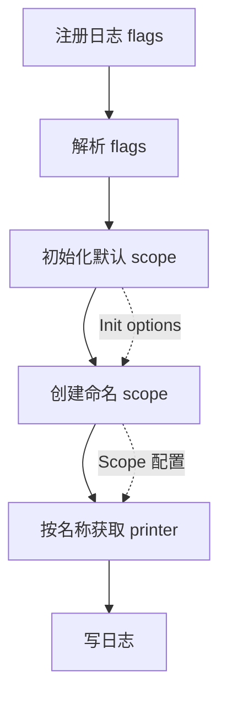

# logmgr

[English](./README.md)

`github.com/nexuer/log/logmgr` 是 `github.com/nexuer/log` 的进程级日志管理包。
应用初始化方只初始化一次 manager，创建带配置的 scope，业务代码使用 `log.Printer` 写日志。

## 安装

```sh
go get github.com/nexuer/log
```

## 启动流程



典型用法：

```go
package main

import (
	"flag"

	"github.com/nexuer/log"
	"github.com/nexuer/log/logmgr"
)

func main() {
	logmgr.AddFlags(flag.CommandLine)
	flag.Parse()

	m := logmgr.Init("server",
		logmgr.WithFields(log.String("service", "api")),
	)

	db := m.MustAddScope("db", logmgr.WithLevel(log.LevelWarn))

	m.Printer().Info("server started")
	m.Printer("worker").Infof("job %d started", 42)
	db.Printer().Warn("database latency is high")
	db.Printer("mysql").Error("query failed")
}
```

文本格式输出：

```text
[server] INFO service=api msg="server started"
[server.worker] INFO service=api msg="job 42 started"
[db] WARN service=api msg="database latency is high"
[db.mysql] ERROR service=api msg="query failed"
```

启用 JSON 格式后的输出：

```json
{"name":"server","level":"INFO","service":"api","msg":"server started"}
{"name":"server.worker","level":"INFO","service":"api","msg":"job 42 started"}
{"name":"db","level":"WARN","service":"api","msg":"database latency is high"}
{"name":"db.mysql","level":"ERROR","service":"api","msg":"query failed"}
```

## 核心 API

`Init(name, opts...)` 安装单例 manager。它只能调用一次；再次调用会 panic。`name` 是默认
scope 名，不能为空。

```go
m := logmgr.Init("server")
logmgr.M().Printer("worker").Info("started")
```

`M()` 返回当前单例 manager；如果还没有调用 `Init`，`M()` 会 panic。这个约束让所有权更清晰：
启动代码负责初始化，其他包可以接收 `log.Printer`，或在启动完成后调用 `logmgr.M()`。

`AddScope(name, opts...)` 创建命名配置区域。如果 scope 已存在则返回错误。`MustAddScope`
遇到错误会 panic。

```go
db, err := logmgr.M().AddScope("db", logmgr.WithLevel(log.LevelWarn))
if err != nil {
	return err
}
_ = db
```

`Printer(name)` 是 get-or-create。相同名称的重复调用会返回同一个 printer，创建 printer
不会改变 scope 配置。

```go
worker := logmgr.M().Printer("worker") // name: server.worker
mysql := logmgr.M().Scope("db").Printer("mysql") // name: db.mysql
```

## Scope

Scope 是一个命名配置区域。同一个 scope 下的 printer 共享同一套最终配置。每个 scope 都有一个
默认 printer，名称就是 scope 名；额外 printer 的名称为 `scope.printer`。

`AddScope` 会继承 `Init` 传入的 options。Scope 自己的 options 会在继承配置之后应用，因此
可以覆盖继承来的配置：

```go
m := logmgr.Init("server",
	logmgr.WithFields(log.String("service", "api")),
	logmgr.WithLevel(log.LevelInfo),
)

db := m.MustAddScope("db", logmgr.WithLevel(log.LevelWarn))

m.Printer().Info("server event")         // level INFO, fields service=api
db.Printer().Info("filtered db event")   // 被 WARN level 过滤
db.Printer().Warn("visible db event")    // fields service=api
db.Printer("mysql").Error("mysql event") // fields service=api
```

可以查看当前已注册的 scope：

```go
for _, scope := range logmgr.M().Scopes() {
	fmt.Println(scope.Name())
}
```

## 配置

配置按下面顺序合并：


规则：

- `Init` options 是默认 scope 和所有 `AddScope` 创建的 scope 的基础配置。
- `AddScope` options 只影响当前 scope，并覆盖继承来的 `Init` options。
- `--log-level`、`--log-format` 这类默认 scope flags 只配置默认 scope。
- `--log-set=key=value` 配置默认 scope。
- `--log-set=scope.key=value` 会在命名 scope 创建时配置该 scope。
- 默认 scope 本身也有名字，所以当默认 scope 名为 `server` 时，
  `--log-set=server.level=debug` 也会配置默认 scope。

可用配置项：

```go
logmgr.WithLevel(log.LevelDebug)
logmgr.WithFormat(logmgr.TextFormat)
logmgr.WithOutput(logmgr.StdoutOutput)
logmgr.WithFileDir("log")
logmgr.WithFileSize(512)
logmgr.WithFileBackups(5)
logmgr.WithFileCompress(true)
logmgr.WithFields(log.String("service", "api"))
logmgr.AppendFields(log.String("component", "worker"))
logmgr.WithKeyValues("service", "api")
logmgr.AppendKeyValues("component", "worker")
logmgr.WithReplacer(replacer)
```

## 运行时调整

`Apply` 会更新已有 scope 的配置，并把新配置重新应用到该 scope 已创建的 printer 上。

```go
logmgr.M().Apply(logmgr.WithOutput(logmgr.StdoutOutput))       // 默认 scope
logmgr.M().Scope("db").Apply(logmgr.WithLevel(log.LevelError)) // db scope
```

`Manager.Apply` 只更新默认 scope，不会更新所有命名 scope。修改命名 scope 时使用
`Scope.Apply`。

## 命令行配置

在 `Init` 之前注册并解析 flags，这样解析后的值才能在默认 scope 和命名 scope 创建时生效。

```go
logmgr.AddFlags(flag.CommandLine)
flag.Parse()

m := logmgr.Init("server")
```

默认 scope flags：

```sh
--log-level=info
--log-format=json
--log-output=stderr
--log-file-dir=log
--log-file-size=512
--log-file-backups=5
--log-file-compress=false
```

动态覆盖：

```sh
--log-set=level=debug
--log-set=server.level=warn
--log-set=db.level=warn
--log-set=db.format=json
--log-set=db.output=file
--log-set=db.file-dir=log/db
--log-set=db.file-size=256
--log-set=db.file-backups=5
--log-set=db.file-compress=false
```

示例：

```sh
app --log-format=json --log-set=db.level=error --log-set=db.output=file
```

这会把默认 scope 设置为 JSON 格式，并在 `AddScope("db")` 时把 `db` scope 配置为
`error` level 和文件输出。
